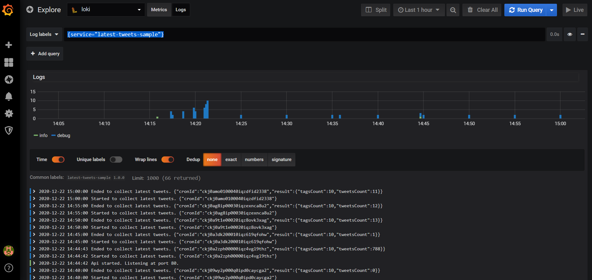
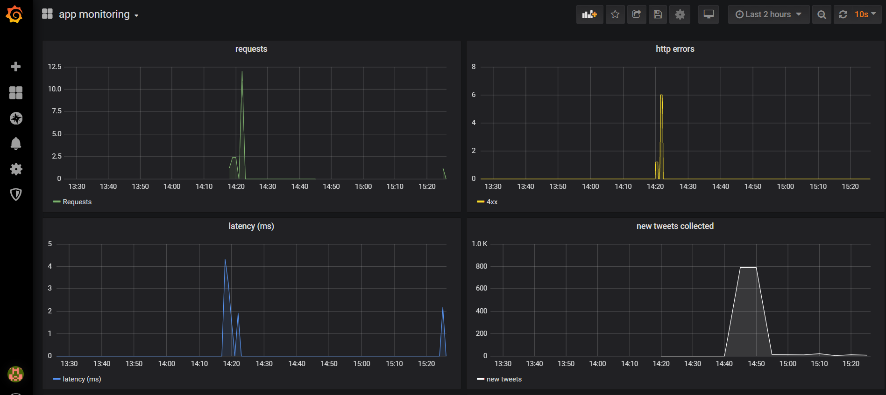

# latest-tweets-sample

Exemplo de aplicação com monitoramento de métricas e logs com Grafana, Prometheus e Loki.

A aplicação consiste em:
- um cron job (a cada 5 min) para busca e armazenamento dos últimos tweets públicos para as #tags cadastradas.
- uma api para cadastro das #tags e obtenção de algumas informações, como:
  - os 5 usuários da amostra coletada que possuem mais seguidores;
  - total de tweets da amostra por hora do dia;
  - total de tweets para cada #tag e idioma.

## Executando

É requisito para executar o exemplo é ter o **Docker** com o **Docker Compose** instalado.

Para executar:

Clone o projeto.

```
git clone https://github.com/diegoaltx/latest-tweets-sample.git
```

Crie um arquivo `.env` na pasta raiz do projeto com o seguinte conteúdo, substituindo `xxx` por um Bearer Token válido da API do Twitter:

```
TWITTER_CLIENT_BEARER_TOKEN=xxx
```
 
Em seguida, dentro da pasta raiz do projeto, execute:

```
docker-compose up
```

Isto irá executar cinco containers:

- **app**, disponível em http://localhost:3000;
- **mongodb**;
- **grafana**, disponível em http://localhost:3001;
- **prometheus**, disponível em http://localhost:3002;
- **loki**.

Para mais detalhes, veja o [docker-compose.yml](docker-compose.yml).

## Funcionamento

### Coleta dos tweets

A coleta dos tweets será executada:
- ao iniciar a aplicação;
- a cada 5 minutos;
- ao ser adicionada uma nova #tag via API.

Há um limite de 10 #tags cadastradas devido ao rate limite da API do Twitter, de 180 requisições por hora para bearer tokens de aplicação.

Ao executar a aplicação via Docker Compose, as seguintes #tags estarão cadastradas por padrão: *#openbanking, #remediation, #devops, #sre, #microservices, #observability, #oauth, #metrics, #logmonitoring e #opentracing*.

### API REST

A API é disponibilizada em http://localhost:3000/api/v1.

Exemplos de requisições para cada recurso e endpoint está disponível na [collection do postman](latest-tweets-sample.postman_collection.json) publicada na pasta raiz do projeto.

### Métricas e logs

As métricas ficam disponíveis no dashboard `app monitoring` disponível no Grafana.

Os logs em tempo real ficam disponíveis na aba *Explore* do Grafana. Basta selecionar o Loki como origem e executar a query `{service="latest-tweets-sample"}`.

O Grafana está disponível em http://localhost:3001, utilize o user `admin` e senha `test`.

## Screenshots e detalhamento do monitoramento

Query de logs da aplicação no Loki via Explorer do Grafana:



Métricas de requisições, execução, latência e erros da aplicação no Grafana:



Métricas e detalhes dos logs da aplicação no Grafana:


